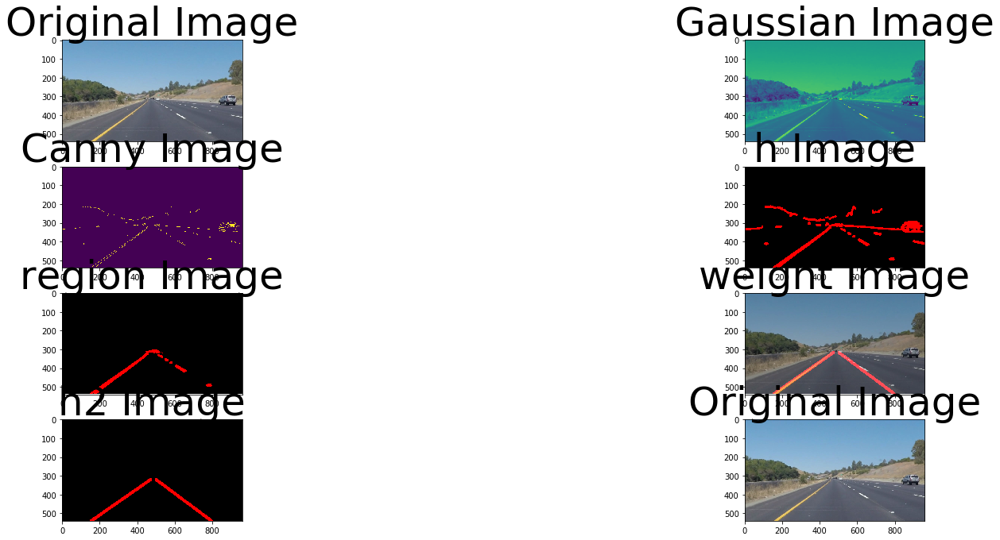

## Self driving car - Lane Marking
## My pipeline discussion 

Step 1: Converted the images to grayscale

Step 2: Did the Gaussian Blur

Step 3: Canny 

Step 4: Hough Line : It is important to look at min_line_length/max_line_gap

Step 5: Region of Interest selection

Step 6: Canny again

Step 7: Hough Lines again ( this is done to collect vertices in limited scope and do a min/max function)

Step 8: Weighted Image call

After testing with the images, tested with VIDEO file and it looked good for the submission. I could think of improving it later to find the min/max in the list of vertices collected in hugh transformation 2 with that I will be able to remove some assumptions of fixed pixels with respect to X along max left lane and min right lane. I could also use/reactive the interpolation code that I orignally submitted.

2 functions for drawline
1. draw_line : This is currently used . It has some extra lines.
2. draw2_line : calculates min/max and plot lines

## Few possible shortcomings
	1. I have used fixed values for extrapolating, trying to fit the line on curve will be an issue
	2. Need investigation on why some extra lines are showing up
	3. Algol , does not look good for different time  of day or night. Like how will you compensate for headlights being on or Camera provides different resolution.
	4. How would you identify rods on road which could be road hazards
	5. All hardcoded values, 
		a. Region of interest
		b. Kernel Size
		c. Thresholds
## Few possible changes
	1. Make use of colors - white to re-check on lanes
	2. Use ployfit to or curvefit that can help define a line
	3. Improvise calculation on extrapolating  to smooth like the test output shown
